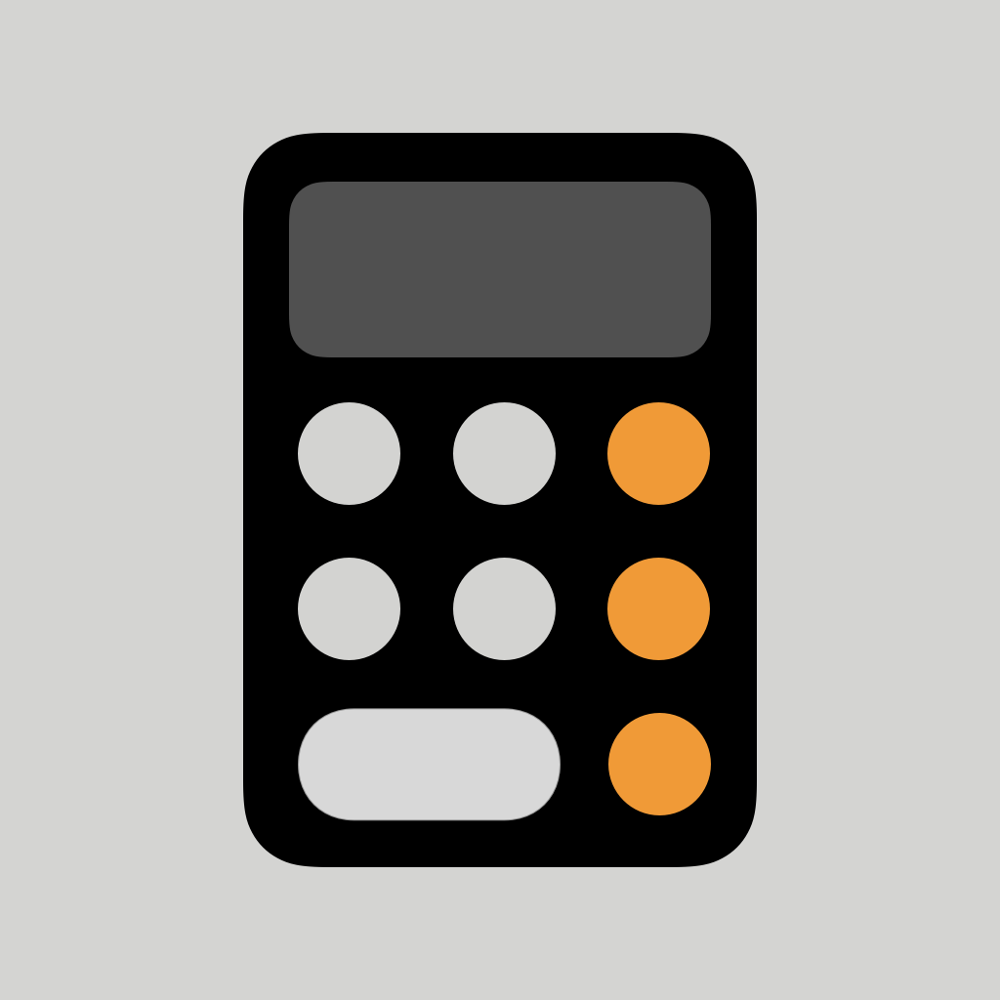

# Calculator

A hobby project using Swift protocol and Swift 5.7's new generics to build an iOS Calculator-like calculator.

Highlights:
- ~~You can use Calculator in Simulator now 🎉~~
- iPad's missing calculator
- Make full use of Swift's protocols and new generics

## Future plan
- [ ] [P1] hover effect
- [ ] [P2] [UI] Circle Button for compact mode
- [ ] [P2] light mode support
> There is a branch for it, this need any ShapeStyle and is currently having some compile issue.
- [ ] [P3] distributed actor support

## Known Issue

- [ ] The compact mode future is not complete yet.

## Copyrights

> The icon of the Calculator app is trademarks of Apple Inc., registered in the U.S. and other countries.